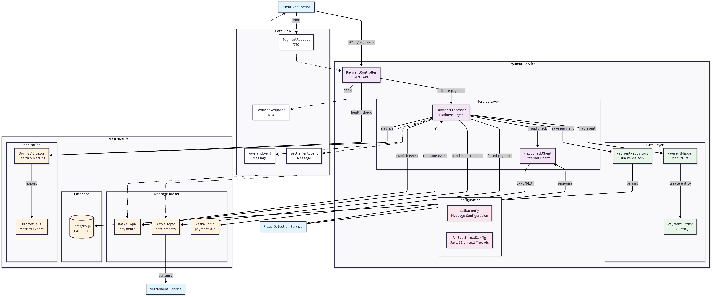

```markdown
# Payment Service

A high-throughput, event-driven payment processing service built with Spring Boot and Apache Kafka, designed for scalability and reliability in financial transaction processing.

## 🏗️ Architecture

```


```

## 🚀 Features

- **High-throughput async processing** via Apache Kafka
- **Real-time fraud detection** integration
- **RESTful API** for payment initiation
- **Event-driven architecture** with settlement publishing
- **Dead Letter Queue (DLQ)** for failed payment handling
- **Transactional processing** with database persistence
- **Health monitoring** with Spring Boot Actuator
- **Comprehensive testing** with Testcontainers
- **Production-ready configuration** with proper logging and metrics

## 🛠️ Technology Stack

- **Java 21** - Programming language
- **Spring Boot 3.2** - Application framework
- **Apache Kafka** - Event streaming platform
- **PostgreSQL** - Primary database
- **MapStruct** - Object mapping
- **Docker & Testcontainers** - Containerization and testing
- **Gradle** - Build automation
- **JUnit 5 & Mockito** - Testing framework

## 📋 Prerequisites

- Java 21 or higher
- Docker & Docker Compose
- Gradle 7+
- PostgreSQL 13+
- Apache Kafka 3.0+

## 🏃‍♂️ Quick Start

### 1. Clone the repository
```bash
git clone <repository-url>
cd payment-service
```

### 2. Start infrastructure services
```bash
# Create docker-compose.yml file (see Infrastructure section below)
docker-compose up -d
```

### 3. Build and run the application
```bash
./gradlew build
./gradlew bootRun
```

### 4. Test the service
```bash
curl -X POST http://localhost:8080/payments \
  -H "Content-Type: application/json" \
  -d '{"amount": 100.00, "currency": "USD"}'
```

## 🐳 Infrastructure Setup

Create a `docker-compose.yml` file in the project root:

```yaml
version: '3.8'
services:
  postgres:
    image: postgres:15
    environment:
      POSTGRES_DB: payments
      POSTGRES_USER: payments
      POSTGRES_PASSWORD: password
    ports:
      - "5432:5432"
    volumes:
      - postgres_data:/var/lib/postgresql/data

  zookeeper:
    image: confluentinc/cp-zookeeper:latest
    environment:
      ZOOKEEPER_CLIENT_PORT: 2181
      ZOOKEEPER_TICK_TIME: 2000

  kafka:
    image: confluentinc/cp-kafka:latest
    depends_on:
      - zookeeper
    ports:
      - "9092:9092"
    environment:
      KAFKA_BROKER_ID: 1
      KAFKA_ZOOKEEPER_CONNECT: zookeeper:2181
      KAFKA_ADVERTISED_LISTENERS: PLAINTEXT://localhost:9092
      KAFKA_OFFSETS_TOPIC_REPLICATION_FACTOR: 1
      KAFKA_AUTO_CREATE_TOPICS_ENABLE: true

volumes:
  postgres_data:
```

## 📚 API Documentation

### Payment Endpoints

#### Create Payment
```http
POST /payments
Content-Type: application/json

{
  "amount": 100.00,
  "currency": "USD"
}
```

**Response:**
```json
{
  "paymentId": "uuid-string",
  "status": "Processing"
}
```

#### Health Check
```http
GET /actuator/health
```

#### Metrics
```http
GET /actuator/metrics
GET /actuator/prometheus
```

## 🔄 Event Flow

1. **Payment Initiation**: Client sends POST request to `/payments`
2. **Event Publishing**: Payment event published to Kafka `payments` topic
3. **Async Processing**: Payment processor consumes event
4. **Fraud Check**: Synchronous fraud validation
5. **Payment Processing**: Database persistence if fraud check passes
6. **Settlement Publishing**: Settlement event published to `settlements` topic
7. **Error Handling**: Failed payments sent to DLQ

## 📊 Configuration

### Application Properties

Key configuration properties in `application.yml`:

```yaml
# Kafka Configuration
spring:
  kafka:
    bootstrap-servers: localhost:9092
    consumer:
      group-id: payment-service
    producer:
      key-serializer: org.apache.kafka.common.serialization.StringSerializer
      value-serializer: org.springframework.kafka.support.serializer.JsonSerializer

# Database Configuration
spring:
  datasource:
    url: jdbc:postgresql://localhost:5432/payments
    username: payments
    password: password

# Custom Topics
kafka:
  topic:
    payments: payments
  group-id: payment-service
```

### Environment Variables

- `DB_USERNAME` - Database username
- `DB_PASSWORD` - Database password
- `KAFKA_BOOTSTRAP_SERVERS` - Kafka bootstrap servers
- `KAFKA_GROUP_ID` - Consumer group ID

## 🧪 Testing

### Run Unit Tests
```bash
./gradlew test
```

### Run Integration Tests
```bash
./gradlew integrationTest
```

### Test Coverage
```bash
./gradlew jacocoTestReport
```

The project includes:
- **Unit tests** with Mockito
- **Integration tests** with Testcontainers
- **API tests** with MockMvc
- **Kafka integration tests**

## 🚀 Deployment

### Docker Build
```bash
docker build -t payment-service:latest .
```

### Kubernetes Deployment
```bash
kubectl apply -f k8s/
```

## 📈 Monitoring & Observability

- **Health Checks**: `/actuator/health`
- **Metrics**: `/actuator/metrics`
- **Prometheus**: `/actuator/prometheus`
- **Logging**: Structured JSON logs
- **Distributed Tracing**: Ready for integration

## 🔧 Development

### Project Structure
```
src/
├── main/java/org/example/paymentservice/
│   ├── controller/     # REST endpoints
│   ├── service/        # Business logic
│   ├── repository/     # Data access
│   ├── dto/           # Data transfer objects
│   ├── entity/        # JPA entities
│   ├── mapper/        # Object mapping
│   ├── client/        # External service clients
│   └── config/        # Configuration classes
└── test/               # Test classes
```

### Code Quality
- **CheckStyle**: Code style enforcement
- **SpotBugs**: Static analysis
- **JaCoCo**: Test coverage
- **SonarQube**: Code quality metrics

## 🤝 Contributing

1. Fork the repository
2. Create a feature branch
3. Write tests for new functionality
4. Ensure all tests pass
5. Submit a pull request

## 📄 License

This project is licensed under the MIT License - see the [LICENSE](LICENSE) file for details.

## 🆘 Support

- **Issues**: GitHub Issues
- **Documentation**: Wiki pages
- **Discussions**: GitHub Discussions
```
